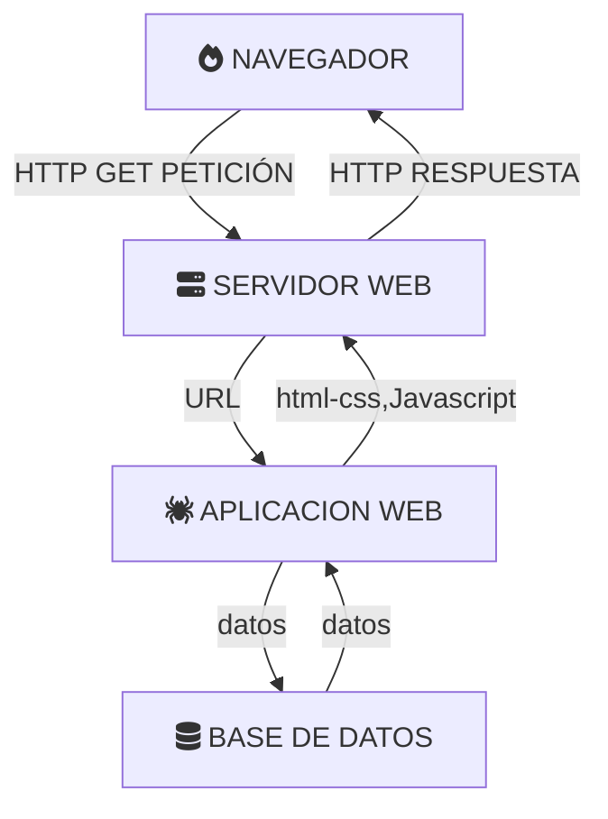

+++
title = "Comunicación cliente-servidor"
tags = ["comunicacion"]
banner = "../img/cliente_servidor.png"
authors = ["Andrés"]
hasMermaid = true
+++

## Con mis propias palabras

La **comunicación entre cliente y servidor** es aquella en la que se solicita una **petición** por parte del cliente, ésta se **transmite** por la red a un servidor (mediante una URL) el cual responde si dispone o no, si tiene autorizaición o no del **recurso** solicitado y se lo devuelve a través de la red al cliente. 

